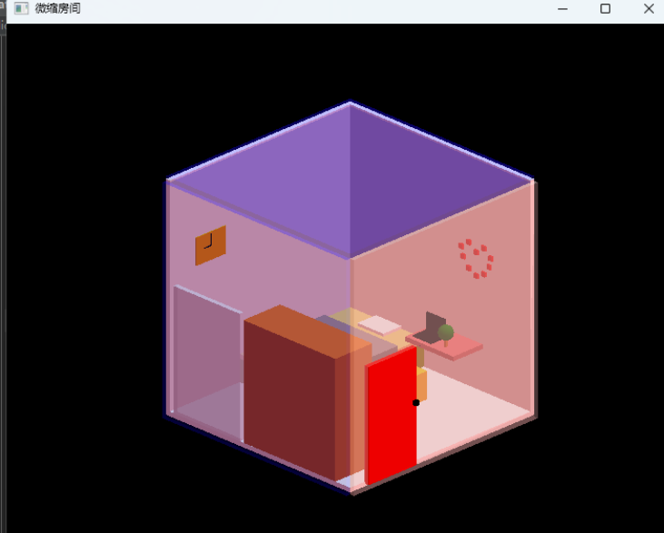

# OpenGL-Simple-Graphing-Coursework

## **一、实验题目：**

《微缩模型—小房间》

绘制一个小屋模型，以窗口的形式显示，使用键盘控制其放大缩小、上下左右里外移动、绕轴旋转等。小屋模型场景有设置颜色、材质、场景光以及物体表面的反射

 

## **二、实验内容：**

1. 定义一个窗口，设置其大小打开位置、指定其显示模式的类型。
2. 设置光照、材质等
3. 设置键盘控制事件
4. 设置颜色混合
5. 启动深度测试
6. 绘制三维图形

 

## **三、关键技术介绍：**

- 窗口创建与设置：

使用GLUT中的函数（参考文档：[glutInit](https://www.opengl.org/resources/libraries/glut/spec3/node10.html)）：

glutInit（初始化GLUT库）、glutInitDisplayMode（指定窗口显示模式的类型）、glutInitWindowSize（定义窗口大小）、glutInitWindowPosition（设置窗口打开位 置） 、glutCreateWindow（设置窗口名称）

- 键盘事件：

使用GLUT中的函数[glutKeyboardFunc](https://www.opengl.org/resources/libraries/glut/spec3/node49.html)*、*[glutSpecialFunc](https://www.opengl.org/resources/libraries/glut/spec3/node54.html)绑定键盘按键事件，用GLd的函数*[glTranslated](https://learn.microsoft.com/zh-cn/windows/win32/opengl/gltranslated)控制平移、 [glRotated](https://learn.microsoft.com/zh-cn/windows/win32/opengl/glrotated)控制旋转、[glScalef](https://learn.microsoft.com/zh-cn/windows/win32/opengl/glscalef)控制放大缩小。 执行完一次键盘事件用glutPostRedisplay重新绘制。

- 图形绘制：

定义数组double RectangularV[8][3];用来保存长方形的8个顶点坐标、定义constract函数，当给定长方体的最里面的点时，计算其余的7个顶点并赋值给这个数组。写了一个build()函数用以绘制方形的4个面，用到了[glvertex3f](https://learn.microsoft.com/zh-cn/windows/win32/opengl/glvertex3f)（指定顶点）和

[glnormal3f](https://learn.microsoft.com/zh-CN/windows/win32/opengl/glnormal3f)（设置当前正向量）、圆形用glTranslatef指定生成位置、*[glutSolidSphere](https://www.opengl.org/resources/libraries/glut/spec3/node81.html)

绘制，使用[glColor4f](https://learn.microsoft.com/zh-CN/windows/win32/opengl/glcolor4f)设置物体颜色和alpha值（透明度）

- 设置光照：

设置三个GLfloat数组分别保存发光位置、强度、颜色比例。用[glLightfv](https://learn.microsoft.com/zh-cn/windows/win32/opengl/gltranslatef)设置漫射光和镜面反光

## **四、演示截图**

